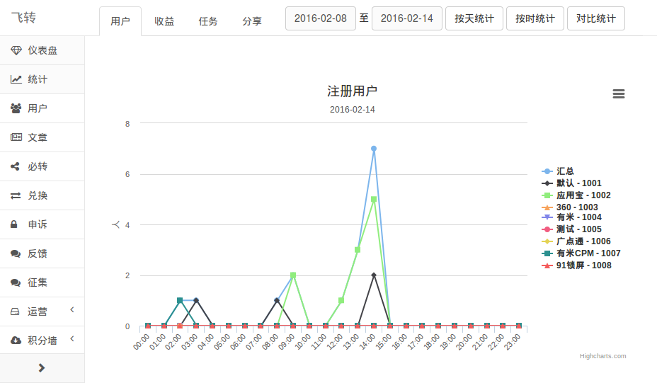
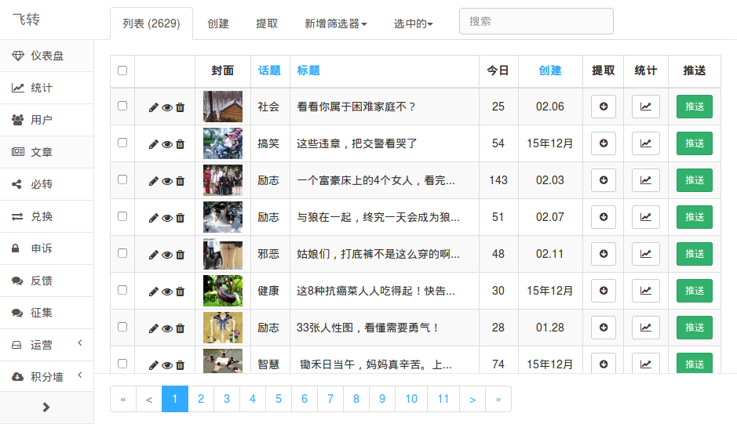

.. _admin:

后台管理
========

后台管理主要是替换了flask-admin的默认模版，以及字段格式化封装、过滤器扩展、
文件管理支持、还有对 `flask.ext.admin.contrib.mongoengine.ModelView`
做了继承扩展，以便更好支持bootstrap的一些样式，给后台管理更好的体验。

后台统计截图:

后台管理截图:

使用方式
--------

后台管理和原本的flask-admin用法没有什么变化，只是在原本的功能上增加了一些功能，
如文本居中、响应式隐藏字段等。

给一个管理视图的例子::

    class ArticleView(ModelView):
        """ 文章管理 """
        show_popover = True
        column_default_sort = '-created'
        column_list = ('title', 'modified', 'created')
        column_center_list = ('modified', 'created')
        column_searchable_list = ('title',)
        column_formatters = dict(
            title=formatter_popover(
                lambda m: (m.title, text2html(m.content)), max_len=60),
        )

后台管理入口在 `admin/__init__.py` 文件::

    def init(app):
        """ 初始化后台管理 """

        admin = Admin(
            name=BaseConfig.SITE_NAME,
            index_view=IndexView('仪表盘', menu_icon_value='diamond'),
            base_template='base.html',
        )

        admin.category_icon_classes = {
            u'运营': 'fa fa-hdd-o',
            u'日志': 'fa fa-database',
        }

        admin.add_view(ArticleView(Article, name='文章'))

后台格式化
----------

格式化的支持主要有类型格式化、常用格式化，以及一些简化的装饰器，如::
        
    # flask admin 用法
    column_formatters = dict(price=lambda v, c, m, n: m.price*2)

    # chiki 简化 - 直接字段
    column_formatters = dict(price=formatter(lambda x: x*2))

    # chiki 简化 - 直接模型
    column_formatters = dict(price=formatter_model(lambda m: m.price*2))

默认类型格式化有：
    - 时间: 2016-02-14 15:10:32 -> 1小时前
    - 图片: 显示图片缩略图，点击可显示原图
    - 文件: 显示文件名称，点击可下载文件

常用字段格式化有:
    - 省略: 内容太长自动省略
    - 弹出框: 可显示完整内容、扩展内容等
    - 缩略图: 链接显示为图片，可支持图片列表
    - 链接: 文字链接，可支持链接列表
    - IP: ip转为运营商、地区等
    - 时间: 转化为日期等

这里给一个例子::

    column_formatters = dict(

        # 省略
        name=formatter_len(max_length=20),

        # 弹出窗
        desc=formatter_popover(lambda m: (m.desc, text2html(m.desc))),

        # 图标
        icon=formatter_icon(lambda m: (m.icon.get_link(40, 40), m.icon.link)),

        # 链接
        user=formatter_link(
            lambda m: (m.user, '/admin/user/?flt1_0=' + str(m.user))),
    )

更多后台格式化的内容请参考 :ref:`formatters` 。

前端优化
--------

属性column_labels与column_choices优化，合并mongoengine的verbose_name、choices信息，
实现在文件 chiki/admin/views.py 下。

属性column_default_sort 优化，支持多字段排序::

    column_default_sort = ('-enable', 'sort')

新增属性column_center_list / 内容居中显示支持::

    column_center_list = (
        'name', 'icon', 'sort', 'enable', 'count', 
        'new', 'today_views', 'modified', 'created','stat'
    )

新增属性column_hidden_list / 小屏(宽度小于1500px)隐藏部分字段::

    column_hidden_list = ('version', 'spm')

新增属性html / 支持直接在模版插入html。

新增属性script / 支持直接在模版插入script。

文件管理
--------

静态文件管理做了一些样式的优化，以及支持多个文件夹的管理::

    from chiki.admin import get_static_admin

    AStaticAdmin = get_static_admin('AStaticAdmin')
    BStaticAdmin = get_static_admin('BStaticAdmin')
    admin.add_view(AStaticAdmin(A_FOLDER, 
        'http://a.example.com/static/', name='文件夹a'))
    admin.add_view(AStaticAdmin(B_FOLDER, 
        'http://b.example.com/static/', name='文件夹b'))

首页跳转
--------

后台管理首页跳转到指定链接下，实现代码::
    
    class IndexView(AdminIndexView):

        @expose('/')
        def index(self):
            if current_app.config.get('INDEX_REDIRECT') != '/admin/':
                return redirect(current_app.config.get('INDEX_REDIRECT'))
            return self.render('base.html')

其他扩展
--------

chiki.admin 还有以下这些扩展::
    - 增加了方法pre_model_change，对数据编辑保存前的处理支持
    - 增加ObjectId Filter的支持，修复flask-admin存在bug
    - 默认显示每页50条数据等默认设置
