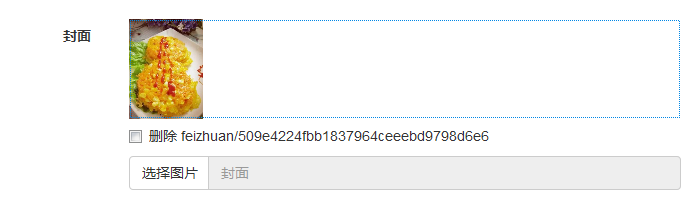

.. _mongoengine:

MongoEngine扩展
===============

Mongoengine扩展主要是加入了阿里云OSS云存储的文件支持，地区字段，
分页支持。

文件存储
--------

这一块实现了通过配置，即可实现本地存储或者云存储的功能。同时，
也做了后台管理的支持，方便操作:

主要有文件 :class:`~chiki.mongoengine.field.XFileField` 及图片
:class:`~chiki.mongoengine.field.XImageField` 两个字段类。另外
为了支持列表图片/文件，有列表 
:class:`~chiki.mongoengine.field.XListField` 字段类（主要支持
文件自动删除功能)。这几个字段也相应的赋值到db(即MongoEngine对象)的同名
属性，用法与Flask-Mongoengine的用法一样，如::

    class Entry(db.Document):
        fileobj = db.XFileField(verbose_name='文件', rename=False)
        icon = db.XImageField(verbose_name='图标', rename=False)
        images = db.XListField(db.XImageField(), verbose_name='相册')

当然，需要有相应的配置，一般在开发中用本地存储，生产环境使用云存储，如::
    
    # OSS云存储
    UPLOADS = dict(
        host='oss-cn-shenzhen-internal.aliyuncs.com',
        access_id='qrJV******kfqQGA',
        secret_access_key='QMCG0mpxQhSw******Mr8rbwqrMEJy',
        link='http://cdn2.haoku.net/%s', # 文件链接模板
        bucket='hkcdn2',                 # 仓库名
        prefix='feizhuan/',              # 文件夹
        type='oss',                      # OSS类型
    )

    # 或本地存储
    UPLOADS = dict(
        type='local', 
        link='/uploads/%s',                        # 文件链接模板
        path=os.path.join(DATA_FOLDER, 'uploads'), # 文件存放路径
    )

配置项默认为UPLOADS，也可改为其他的，如下面支持多个配置::
    
    class Config(object):
        UPLOADS = dict(
            type='local', 
            link='/uploads/%s',                        # 文件链接模板
            path=os.path.join(DATA_FOLDER, 'uploads'), # 文件存放路径
        )
        UPLOADS2 = dict(
            type='local', 
            link='/uploads2/%s',                         # 文件链接模板
            path=os.path.join(DATA_FOLDER, 'uploads2'), # 文件存放路径
        )

    class Entry(db.Document):
        fileobj = db.XFileField()
        icon = db.XImageField(config='UPLOADS2')

    # 本地文件/图片链接可访问支持
    # UPLOADS 默认会被支持，其他的需要自己手动添加

    from chiki.uploads import init_uploads
    init_uploads(app, config='UPLOADS2')

:class:`~chiki.mongoengine.field.XImageField` 继承于
:class:`~chiki.mongoengine.field.XFileField` ，下面给出几种赋值方式::

    class Entry(db.Document):
        icon = db.XImageField()
    
    entry = Entry()
    entry.icon = 'abc/1.png' # 不发生文件存储操作
    entry.icon = dict(stream=open('1.png'), format='png')
    entry.icon = [open('1.png'), 'png']

    # FileStorage, Wtforms上传文件字段，可直接赋值
    storage = FileStorage()
    entry.icon = storage
    entry.save()

:class:`~chiki.mongoengine.field.XFileField` 有
:attr:`~chiki.mongoengine.field.XFileField.link`、
:attr:`~chiki.mongoengine.field.XFileField.content` 等属性，分别为链接、内容。
:class:`~chiki.mongoengine.field.XImageField` 还有
:meth:`~chiki.mongoengine.field.XImageField.get_link` 可实现截图的链接。

地区字段
--------

:class:`~chiki.mongoengine.field.AreaField` 支持省市区三级联动，相应的做了
后台管理的支持及wtforms的扩展:

用法和上面的文件存储一样::

    class User(db.Document):
        location = db.AreaField(verbose_name='地区')

分页支持
--------

为了更加方便使用分页功能而做了 :class:`~chiki.mongoengine.pagination.Pagination`
的扩展，同时也替换了flask-mongoengine原有QuerySet的paginate的方法，支持直接根据当前endpoint
生成分页链接，可以传递扩展参数::

    page = max(1, request.args.get('page', 1, int))
    per_page = max(1, min(10, request.args.get('per_page', 20, int)))
    pag = Good.objects(category=cate).order_by('-created') \
        .paginate(id=id, page=page, per_page=per_page)

示例分页模板::

    
    
        <ul class="pagination">
        
            
            <li class="active">
                <a href="#">{{ page }} 
                    (current)
                </a>
            </li>
            
            <li class="disabled"><a href="#">{{ page }}</a></li>
            
            <li><a href="{{ link }}">{{ page }}</a></li>
            
        
        </ul>
    
    

    {{ render_pages(pag) }}
