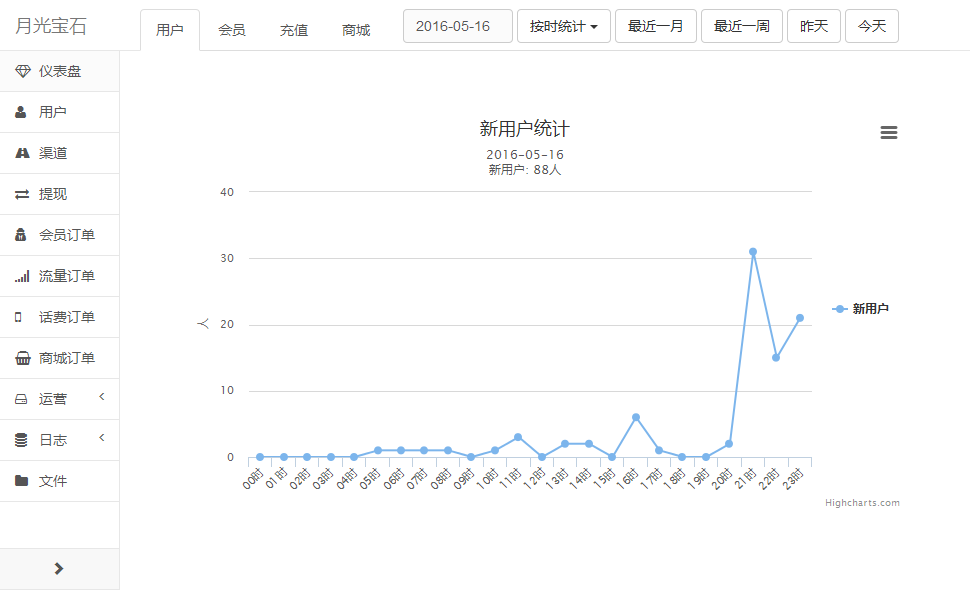
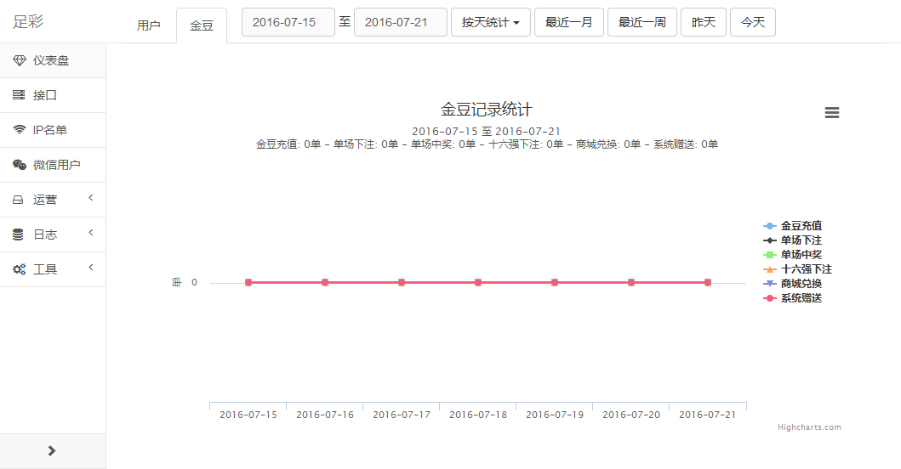

.. _stat:

数据统计
========
由于数据统计几乎在每一项目中都会用到，而且不管在统计服务还是数据展示，
基本上的代码都是差不多的，因此通过封装后，业务开发成本大大降低。

统计服务
--------
统计一般有5种常见方式：数量汇总、金额（数值）累计、去重后数量汇总、分组统计，
还有自定义统计方式。chiki对于的抽象成为6个方法：
:meth:`~chiki.stat.Stat.count` 、:meth:`~chiki.stat.Stat.sum` 、
:meth:`~chiki.stat.Stat.distinct` 、:meth:`~chiki.stat.Stat.aggregate` 、
:meth:`~chiki.stat.Stat.aggregate` 、:meth:`~chiki.stat.Stat.func` ，
按天、按时统计的逻辑完全抽象。

下面给出统计实例，具体方法的参数解释自己看上面的函数链接::

    # coding: utf-8
    from collections import defaultdict
    from chiki import Stat
    from datetime import datetime
    from zucai.base import um
    from zucai.models import Bet, PointLog, PointOrder

    stat = Stat()

    # 用户统计
    stat.count('user_new', um.models.User, field='registered')
    stat.distinct('user_active', um.models.UserLog, 'user')
    stat.aggregate('channel_user_new_{_id}', um.models.User,
        {'$group':dict(_id='$channel', value={'$sum':1})},
        field='registered')
    stat.aggregate2('channel_user_active_{_id}', um.models.User,
        um.models.UserLog, 'user',
        {'$group':dict(_id='$channel', value={'$sum':1})})
    stat.sum('point_pay_price', PointOrder, 'price',
        payment=PointOrder.PAYMENT_DONE)

    @stat.func
    def game(key, day, start, end, hour):
        pass

    run = stat.run(start=datetime(2016, 6, 10), minutes=2)

后台统计图表
------------
先给下一项目的统计截图:

上面的统计服务把通过crontab定时把数据按天按时统计，存到StatLog中。
统计图表的话，通过1个装饰器，即可实现数据映射(上面的截图即为下面的代码所作用)::

    # coding: utf-8
    from chiki import statistics
    from chiki.admin import AdminIndexView

    @statistics()
    class IndexView(AdminIndexView):
        """ 仪表盘 """

        tabs = [
            dict(endpoint='.index', title='用户统计', text='用户'),
            dict(endpoint='.point', title='金豆统计', text='金豆'),
        ]

        u = um.models.User
        datas = dict(
            index=[
                dict(title='新用户统计', suffix='人', series=[
                    dict(name='新用户', key='user_new'),
                ]),
                dict(title='活跃用户统计', suffix='人', series=[
                    dict(name='活跃用户', key='user_active'),
                ]),
            ],
            point=[
                dict(title='金豆记录统计', suffix='单', series=[
                    dict(name='金豆充值', key='point_pay'),
                    dict(name='单场下注', key='bet'),
                    dict(name='单场中奖', key='win'),
                    dict(name='十六强下注', key='bet_win16'),
                    dict(name='商城兑换', key='exchange'),
                    dict(name='系统赠送', key='other'),
                ]),
            ],
        )
